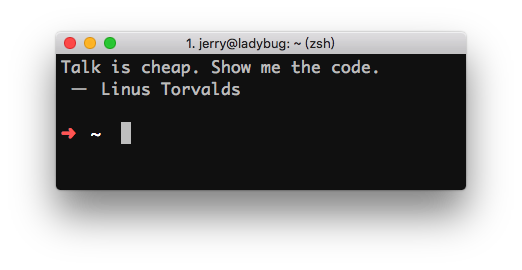

hacker-quotes
============================

An [`oh-my-zsh`](https://github.com/robbyrussell/oh-my-zsh) plugin, just output a hacker quote randomly when you open a terminal.



How to install
--------------

To install `hacker-quotes` under `oh-my-zsh`:

Step 1: Clone this repository in `oh-my-zsh`'s plugins directory:

```bash
git clone git@github.com:oldratlee/hacker-quotes.git ~/.oh-my-zsh/custom/plugins/hacker-quotes
```

Step 2: Activate the plugin in `~/.zshrc`:

```bash
plugins=([plugins...] hacker-quotes)
```

Congratulations! Open a new terminal and check it! :sparkles:
